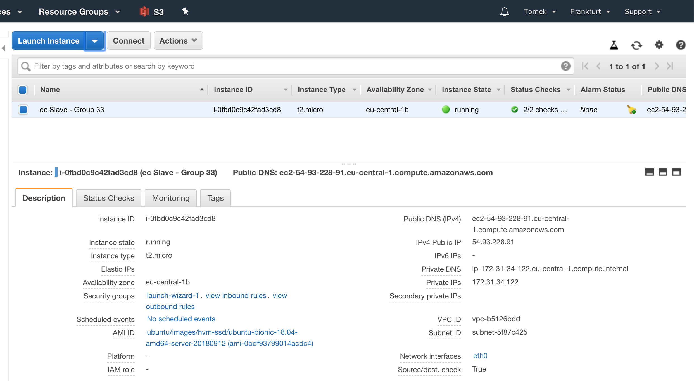

# Distributed Key-Value Store
### Enterprise Computing WS 2018/19 - Assignment 2 - Distributed Key Value Storage
Authors: Jacek Janczura & Tomasz Tkaczyk

## Implementation

<br><br>
The aim of the project was to implement simple distributed key-value store which consists of two replicas, whereby one is the master and one is the slave. Clients always write to the master but can potentially read from both replica. 
<br> Additionally we should measure <b>staleness</b> and <b>latency</b> of our system in the scenario of <b>asynchronous</b> and <b>synchronous</b> replication from the master server to all of the slave servers.
<br><br> <b>Synchronous</b> replication in case of for example write(key, value) message to the replica servers means that the message will be send from client to the master server. Master server will replicate the write on all of the replicas. When the master gets the response from all of the replicas he sends the final response to the client that the value is storred correctly. In this case client knows that the message is replicated already on other replicas(slave servers).
<br><br> In contrary to synchronous replication <b>asynchronous</b> replication sends the response to the client just after storing the value in his KV store and than the master replicates that value on the other replicas.

* JavaDoc is provided. All the details connected with the implementation can be found here - http://ec-docs.s3-website.eu-central-1.amazonaws.com

* Ports and hosts are taken from config.properties file during the runtime. 
```
portSlave=8000
hostSlave=127.0.0.1
portMaster=8001
hostMaster=127.0.0.1
```
* All logs are stored in the file - EC_Assignment_2.log

* To run the simple main just run the jar. <br>
 `java -jar target/EC_Assignment_2-1.0-SNAPSHOT-shaded.jar `

### Deployment
After the development phase, we've deployed two variants of our code on two AWS EC2 instances. We've decided to take two t2.micro instances and spin them in different avalibility zones. The Master instance was deployed on  *EU-West-1* (Irland), whereas the Slave was deployed on *EU-Central-1* (Frankfurt). 



## 2) Benchmarking Latency and Staleness 

* <b>Latency</b> - full time of the write message. Time between sending the write message and receiving the response from the server. 
* <b>Staleness</b> - inconsitency in storage. Time period in which current state differs among the replicas. It begins after  commiting the change in storage on master node, and ends right after commiting the same change on the last replica. 

Since the master and slave servers are running on separate AWS ec2 instances we can trigger client from local computer.
<br><br>One server is located in Ireland the other in Frankfurt and our local client is in Berlin. In our calculations and analysis we need to remember that in Ireland the timezone is different.
<br><br>The write message which is supposed to store the value under fixed key will be sent to the master server 100 times using synchronous replication and 100 times using asynchronous replication to the slae server.

```
    /**
     * Method used for benchmarking latency and staleness of asynchronic replication. 
     * This method sends an update (In our KV store write is equal to an update) every second for 100s using asynchron. replication.
     */
    public void crazyUpdateAsynchronic() {
        for (int i = 0; i < 100; i++) {
            Request req = asyncWrite("Asy", "req" + i);
            sendSyncMsgToMaster(req);
            sleep(1000);
        }
    }
    /**
     * Method used for benchmarking latency and staleness of synchronic replication. 
     * This method sends an update (In our KV store write is equal to an update) every second for 100s using synchron. replication.
     */
    public void crazyUpdateSynchronic() {
        for (int i = 0; i < 100; i++) {
            Request req = syncWrite("Sy", "req" + i);
            sendSyncMsgToMaster(req);
            sleep(1000);
        }
    }
```


After 200 write operations, we manually collect the logs from Client, Master and Slave. The logs are then merged together, and manually transformed into a single CSV file.

## 3) Analysis
Average write message with synchronous replication latency - 407 ms
<br><br>
Average write message with asynchronous replication latency - 283,5 ms
<br><br>
Average write message with synchronous replication staleness - 124 ms
<br><br>
Average write message with asynchronous replication staleness - 135 ms
 
#### Synchronous replication 
After collecting the logs, we have applied standard data cleaning transformations and aggregations to compute time differences between particular events. 
First we've analysed synchronous replication. Figure below depicts the differences in latency for 100 requests. On average one request needs 407ms to be processed (median 365ms). On a diagram we can observe 3 'peaks' which were probably caused by the network delays.      


 
#### Asynchronous replication 
In case of the asynchronous replication, the average latency is almost two times faster than synchronous replication. 


